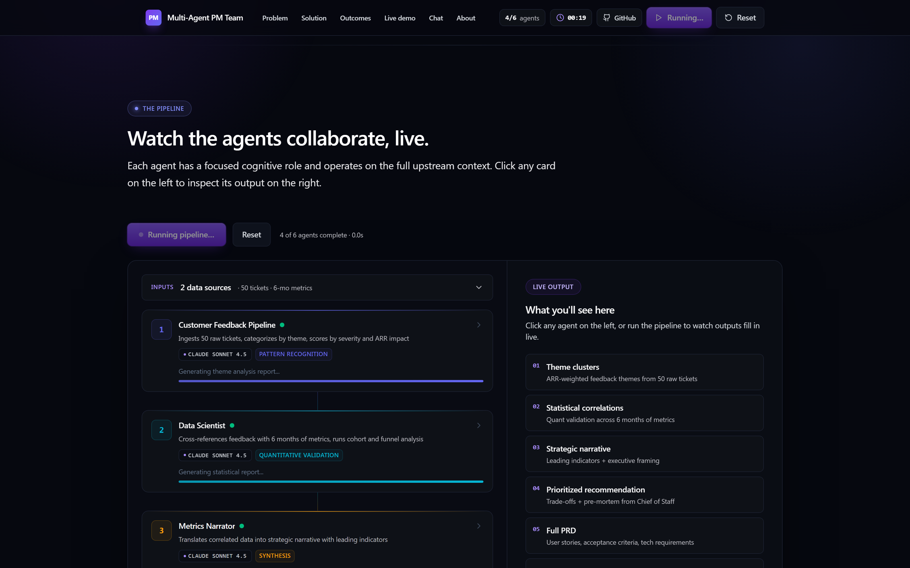
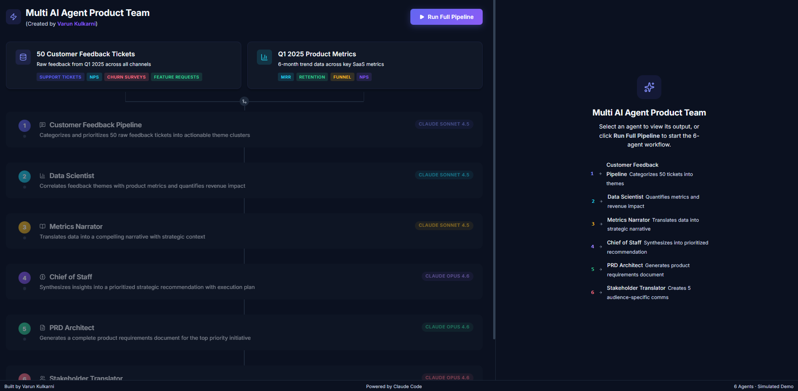
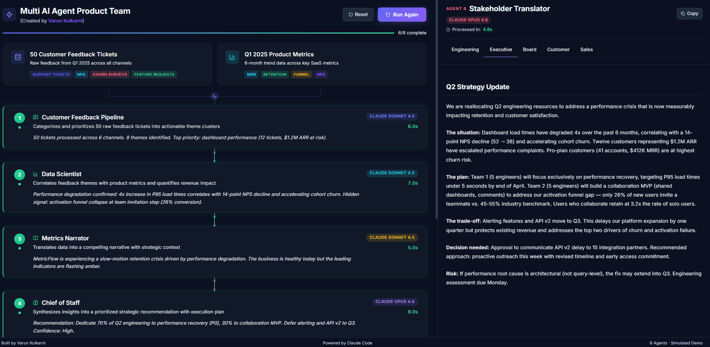

# ⚡ Multi AI Agent Product Team

**A fully orchestrated 6-agent AI pipeline that transforms raw customer feedback into executive-ready strategy — PRDs, stakeholder comms, metrics dashboards, and data-driven recommendations — making AI product teams 10x faster.**

[](https://claude.ai)
[](https://claude.ai/code)
[](https://github.com/features/copilot)
[](https://opensource.org/licenses/MIT)

**Built by [Varun Kulkarni](https://github.com/varunk130)** · Works with Claude Code & GitHub Copilot · [Contributing](./CONTRIBUTING.md)

---



## Why This Exists

Product teams drown in fragmented signals — support tickets, NPS surveys, churn interviews, product metrics — scattered across tools and teams. Synthesizing these into coherent strategy is a bottleneck that costs weeks of PM time per quarter.

This project demonstrates how **multi-agent AI orchestration** can compress that entire workflow into a single automated pipeline:

```
50 raw feedback tickets + 6 months of product metrics
        ↓ 6 specialized AI agents ↓
Strategic recommendation + PRD + 5 stakeholder communications
```

Each agent has a distinct cognitive role, receives upstream context, and produces structured output that feeds the next stage — mimicking how a high-performing product org actually operates, but in seconds instead of weeks.

---

## The Pipeline

| # | Agent | Role | Cognitive Function |
|---|-------|------|--------------------|
| **1** | [Customer Feedback Pipeline](./agents/01-customer-feedback-pipeline/) | Ingests 50 raw tickets, categorizes by theme, scores by severity and ARR impact | **Pattern Recognition** — clustering unstructured text into actionable signal |
| **2** | [Data Scientist](./agents/02-data-scientist/) | Cross-references feedback themes with 6 months of product metrics, runs cohort and funnel analysis | **Quantitative Validation** — confirming qualitative signals with statistical evidence |
| **3** | [Metrics Narrator](./agents/03-metrics-narrator/) | Translates correlated data into a strategic narrative with leading indicators | **Synthesis** — converting numbers into a story that drives decisions |
| **4** | [Chief of Staff](./agents/04-chief-of-staff/) | Evaluates trade-offs across multiple strategic options, produces prioritized recommendation | **Strategic Reasoning** — weighing competing priorities under uncertainty |
| **5** | [PRD Architect](./agents/05-prd-architect/) | Generates a complete product requirements document for the top-priority initiative | **Specification** — translating strategy into executable requirements |
| **6** | [Stakeholder Translator](./agents/06-stakeholder-translator/) | Transforms the PRD into 5 audience-tailored communications (Engineering, Executive, Board, Customer, Sales) | **Audience Adaptation** — same information, different framing per stakeholder |

### What Makes This Interesting

- **Sequential context accumulation**: Each agent operates on the *full upstream context* — not just the previous agent's output. Agent 4 (Chief of Staff) reasons over the combined output of Agents 1-3, enabling emergent strategic insights that no single agent could produce.
- **Cognitive specialization over generic prompting**: Rather than one monolithic prompt, each agent has a focused cognitive role. Focused, single-purpose agents consistently outperform generalist ones on complex reasoning tasks.
- **Structured handoffs with typed contracts**: Agents don't pass raw text — they produce structured payloads (theme clusters with ARR impact, statistical correlations with confidence intervals, prioritized options with pre-mortem analysis) that downstream agents can reason over reliably.
- **Audience-aware generation**: Agent 6 demonstrates that the same underlying information requires fundamentally different framing for different stakeholders — a problem that maps directly to alignment challenges around audience modeling.

---

## Screenshots

### Dashboard Overview — Idle State
The pipeline visualizes all 6 agents with their roles, model assignments (Sonnet 4.5 / Opus 4.6), and data flow connectors. Input sources (50 feedback tickets + product metrics) are inspectable before running.



### Pipeline Execution — Agent Processing
Real-time progress tracking with per-agent sub-step visibility, elapsed timing, and animated data flow between agents. Each agent card updates live as it processes.


### Executive Recommendations — Stakeholder Output
Agent 6 produces 5 distinct communications from a single PRD. Tabs switch between Engineering, Executive, Board, Customer, and Sales framings — each tailored to its audience's priorities and information needs.



---

## Quick Start

```bash
# Clone the repository
git clone https://github.com/varunk130/multi-ai-agent-pm-team.git
cd multi-ai-agent-pm-team

# Install dependencies
npm install

# Start development server
npm run dev
```

Open [http://localhost:5173](http://localhost:5173) to see the pipeline dashboard.

---

## Architecture

```
┌─────────────────────────────────────────────────────┐
│                    React Frontend                    │
│                                                     │
│  ┌──────────┐  ┌──────────────┐  ┌───────────────┐  │
│  │ Pipeline │  │ Agent Detail  │  │  Markdown     │  │
│  │ View     │──│ Panel        │──│  Renderer     │  │
│  │          │  │ (tabbed)     │  │  (custom)     │  │
│  └──────────┘  └──────────────┘  └───────────────┘  │
│       │                                              │
│  ┌──────────────────────────────────────────────┐    │
│  │         usePipelineRunner (orchestrator)      │    │
│  │  - Sequential agent execution                │    │
│  │  - Sub-step state machine per agent          │    │
│  │  - Timing + progress tracking                │    │
│  └──────────────────────────────────────────────┘    │
│       │                                              │
│  ┌──────────────────────────────────────────────┐    │
│  │         Structured Agent Outputs              │    │
│  │  - Typed payloads (themes, correlations,     │    │
│  │    narratives, recommendations, PRD, comms)  │    │
│  └──────────────────────────────────────────────┘    │
└─────────────────────────────────────────────────────┘
```

### Key Technical Decisions

- **Custom Markdown renderer**: Built from scratch to handle tables, code blocks, blockquotes, and inline formatting within the dark theme — standard MD libraries couldn't match the design requirements.
- **RAF-based typewriter**: Uses `requestAnimationFrame` for smooth character-by-character text reveal with markdown-aware safe indices (won't break mid-tag).
- **State machine per agent**: Each agent transitions through `idle → waiting → processing → complete` with independent sub-step cycling, enabling granular progress UX.
- **Zero external UI libraries**: No component library dependencies — every card, connector, animation, and interaction is custom-built for precise control over the dark theme aesthetic.

---

## Tech Stack

| Layer | Technology |
|-------|-----------|
| Framework | React 19 + Vite 7 |
| Styling | Tailwind CSS v4 + CSS custom properties |
| Icons | Lucide React |
| Typography | Inter (Google Fonts) |
| Animations | CSS keyframes + JS-driven RAF loops |
| Build | Vite with HMR |

---

## Project Structure

```
multi-ai-agent-pm-team/
├── index.html
├── package.json
├── vite.config.js
├── CLAUDE.md                       # Claude Code instructions
├── .github/
│   └── copilot-instructions.md     # GitHub Copilot instructions
├── agents/
│   ├── 01-customer-feedback-pipeline/
│   │   ├── README.md               # Agent role, inputs, outputs, techniques
│   │   └── config.js               # Agent configuration
│   ├── 02-data-scientist/
│   ├── 03-metrics-narrator/
│   ├── 04-chief-of-staff/
│   ├── 05-prd-architect/
│   └── 06-stakeholder-translator/
├── src/
│   ├── main.jsx                    # Entry point
│   ├── index.css                   # Global styles, animations, theme variables
│   ├── App.jsx                     # Root component + state coordination
│   ├── hooks/
│   │   ├── usePipelineRunner.js    # Pipeline orchestration state machine
│   │   ├── useTypewriter.js        # RAF-based typewriter effect
│   │   ├── useAgentStatus.js       # Agent status management
│   │   └── useTimer.js             # Pipeline timer
│   ├── components/
│   │   ├── Layout.jsx              # Two-panel layout (pipeline + detail)
│   │   ├── PipelineHeader.jsx      # Title, timer, run/reset controls
│   │   ├── PipelineView.jsx        # Agent nodes + data flow connectors
│   │   ├── AgentNode.jsx           # Individual agent card with status
│   │   ├── AgentDetailPanel.jsx    # Right panel: agent output viewer
│   │   ├── DataFlowConnector.jsx   # Animated connector between agents
│   │   ├── MarkdownRenderer.jsx    # Custom MD→HTML renderer
│   │   ├── ProgressStepper.jsx     # Pipeline progress bar
│   │   ├── MetricBadge.jsx         # Completion stat badges
│   │   ├── StatusDot.jsx           # Agent status indicator
│   │   └── Toast.jsx               # Copy confirmation toast
│   └── data/
│       ├── feedbackData.js         # 50 synthetic customer tickets
│       ├── metricsData.js          # 6-month SaaS metric trends
│       └── agent[1-6]Output.js     # Pre-computed agent outputs
├── docs/
│   ├── ARCHITECTURE.md
│   ├── AGENT-DESIGN.md
│   ├── PIPELINE-ORCHESTRATION.md
│   └── ...
└── screenshots/
    ├── dashboard-overview.png
    ├── agent-run.png
    └── exec-recommendations.png
```

---

## Design Philosophy

### Why a Simulated Pipeline (Not Live API Calls)?

This is a **design and architecture demo**, not a wrapper around an API. The outputs were generated by Claude and are frozen to ensure:

1. **Deterministic, reviewable quality** — every output is curated to demonstrate what a well-orchestrated agent pipeline *should* produce
2. **Instant demo experience** — no API keys, no rate limits, no cost per run
3. **Focus on orchestration patterns** — the interesting problem is agent sequencing, context accumulation, and audience adaptation — not raw LLM inference

In a production system, each agent would be a Claude API call with structured output schemas, and the pipeline runner would handle retries, streaming, and context window management.

### Design Details

- **Dark theme with subtle depth**: Cards use layered backgrounds (`#0B1120` → `#111827` → `#1E293B`) with indigo-tinted borders for depth without visual noise.
- **Agent color system**: Each agent has a distinct theme color (indigo, cyan, amber, purple, emerald, rose) that flows through its number badge, status indicators, model tags, and data flow connectors.
- **Processing state design**: Active agents show a background pulse animation, cycling sub-step text, and a spinning loader — communicating "work in progress" without being distracting.
- **Data flow connectors**: Animated traveling dots between agents visualize the sequential handoff, with gradient colors transitioning from the source agent's theme to the target's.

---

## Security & Governance

- 🔒 **No secrets in code** — No API keys, tokens, or credentials anywhere in the repository
- 📊 **100% synthetic data** — All customer names, companies, tickets, and metrics are fictional
- 🛡️ **No external API calls** — Demo uses pre-computed outputs, no live data transmission
- 📋 **Security policy** — See [SECURITY.md](./SECURITY.md) for vulnerability disclosure
- 👥 **Code review** — All changes require maintainer review via [CODEOWNERS](./.github/CODEOWNERS)
- 🔄 **Dependency monitoring** — Dependabot configured for weekly security scans

---

## Tools Compatibility

This project is designed to work with both major AI coding assistants:

| Tool | Configuration File | Purpose |
|------|-------------------|---------|
| **Claude Code** | [`CLAUDE.md`](./CLAUDE.md) | Project context, code style, architecture |
| **GitHub Copilot** | [`.github/copilot-instructions.md`](./.github/copilot-instructions.md) | Code conventions, security rules |

---

## Disclaimer

All data in this project is entirely synthetic and mock-generated for demonstration purposes. Customer names, company names, feedback tickets, product metrics, ARR figures, and all agent outputs are fictional. No real customer data, proprietary information, or actual business metrics were used. Any resemblance to real companies or individuals is purely coincidental.

---

## Contributors

| Contributor | Role |
|-------------|------|
| **[Varun Kulkarni](https://github.com/varunk130)** | Creator, architect, maintainer |
| **[Claude](https://claude.ai)** | AI contributor — agent design, code generation, pipeline architecture |
| **[GitHub Copilot](https://github.com/features/copilot)** | AI pair programming and code assistance |

---

## License

[MIT](./LICENSE) © [Varun Kulkarni](https://github.com/varunk130)

---

**Built by [Varun Kulkarni](https://github.com/varunk130)** · Powered by Claude · Works with Claude Code & GitHub Copilot
